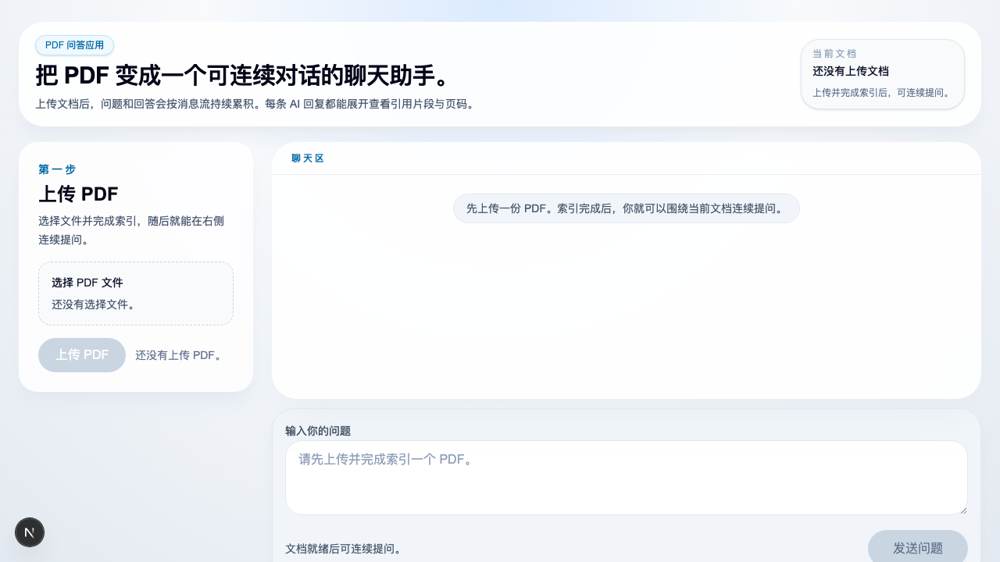

# PDF Chat App

[中文](README.md)

[](LICENSE)


A web application for uploading PDFs, building vector indexes, and asking follow-up questions scoped to the current document.

Live frontend URL: [https://pdf-chat-with.vercel.app/](https://pdf-chat-with.vercel.app/)

## Screenshot



## Features

- Automatically parses PDFs, chunks text, generates embeddings, and persists a FAISS index
- Reuses existing indexes for duplicate uploads using file-content `SHA-256`
- Scopes QA to the current `document_id` to avoid cross-document contamination
- Provides a chat-style frontend with streaming answers and Markdown rendering
- Returns citation metadata and page references for every AI answer

## Tech Stack

- Frontend: Next.js 16, React 19, Tailwind CSS 4, TypeScript
- Backend: FastAPI, Uvicorn, Python 3.10
- Vector store: FAISS
- PDF parsing: PyMuPDF
- LLM / embeddings: OpenAI-compatible APIs, currently configured for DashScope compatibility

## Repository Structure

```text
pdf-chat-app/
├── frontend/              # Next.js frontend
│   ├── src/app/           # App routes and page entry
│   ├── src/components/    # Chat, upload, citation UI
│   ├── src/lib/           # API wrappers and client utilities
│   ├── src/types/         # Frontend domain types
│   └── src/test/          # Frontend test setup
├── backend/               # FastAPI backend
│   ├── app/main.py        # App initialization and router registration
│   ├── app/routes/        # HTTP routes
│   ├── app/services/      # PDF, retrieval, embedding, QA services
│   ├── data/uploads/      # Runtime PDF storage
│   ├── data/index/        # Runtime FAISS indexes and document registry
│   └── tests/             # Backend tests
├── AGENTS.md              # Internal agent guidance for this repository
└── README.en.md
```

## Requirements

- Node.js 20+ and npm
- Python 3.10+
- A valid embedding API key
- A valid LLM API key if you want answer generation

## Quick Start

### 1. Clone the repository

```bash
git clone <your-repo-url>
cd pdf-chat-app
```

### 2. Start the backend

```bash
cd backend
python3.10 -m venv .venv
. .venv/bin/activate
pip install -r requirements.txt
cp .env.example .env
uvicorn app.main:app --reload
```

Default URL: `http://127.0.0.1:8000`

Health check:

```bash
curl http://127.0.0.1:8000/health
```

### 3. Start the frontend

```bash
cd frontend
npm install
cp .env.example .env.local
npm run dev
```

Default URL: `http://localhost:3000`

## Environment Variables

Commit only `.env.example` files. Real `.env` files must stay untracked.

### Backend

Copy [`backend/.env.example`](backend/.env.example) to `backend/.env` and fill in real values:

```env
EMBEDDING_PROVIDER=dashscope
DASHSCOPE_API_KEY=your_dashscope_api_key_here
EMBEDDING_API_KEY=
EMBEDDING_MODEL=text-embedding-v4
EMBEDDING_BASE_URL=https://dashscope.aliyuncs.com/compatible-mode/v1
LLM_PROVIDER=dashscope
LLM_API_KEY=
LLM_MODEL=qwen-plus
LLM_BASE_URL=https://dashscope.aliyuncs.com/compatible-mode/v1
OPENAI_API_KEY=
OPENAI_BASE_URL=
FRONTEND_URL=http://localhost:3000
VERCEL_FRONTEND_URL=
CORS_ALLOW_ORIGINS=
CORS_ALLOW_ORIGIN_REGEX=
```

Notes:

- DashScope can be used as both the embedding and LLM provider through its OpenAI-compatible API
- For other providers, configure the matching variables read by `backend/app/services/embedding.py` and `backend/app/services/llm.py`
- `FRONTEND_URL` and `VERCEL_FRONTEND_URL` are added to the backend CORS allowlist; `CORS_ALLOW_ORIGINS` can append more origins as a comma-separated list
- Use `CORS_ALLOW_ORIGIN_REGEX` if you want to match Vercel preview domains
- `/upload` immediately performs indexing, so embedding configuration must be valid before uploading files

### Frontend

Copy [`frontend/.env.example`](frontend/.env.example) to `frontend/.env.local`:

```env
NEXT_PUBLIC_API_BASE_URL=http://127.0.0.1:8000
```

In Vercel production, set this to your Railway backend public URL, for example `https://your-backend.up.railway.app`.

## Usage

### Upload a PDF

```bash
curl -X POST \
  -F "file=@/absolute/path/to/your.pdf;type=application/pdf" \
  http://127.0.0.1:8000/upload
```

The upload response contains a `document_id`. The frontend stores it and sends it with follow-up questions.

### Ask a question

```bash
curl -X POST \
  -H "Content-Type: application/json" \
  -d '{"question":"What is this PDF about?","document_id":"<document_id>","top_k":3}' \
  http://127.0.0.1:8000/ask
```

### Ask a question with streaming

```bash
curl -N -X POST \
  -H "Content-Type: application/json" \
  -d '{"question":"What is this PDF about?","document_id":"<document_id>","top_k":3}' \
  http://127.0.0.1:8000/ask/stream
```

`/ask/stream` uses `text/event-stream` and emits `start`, `delta`, `done`, and `error` events.

## Runtime Data and Persistence

`backend/data/uploads/` and `backend/data/index/` are runtime data directories, not source artifacts.

They currently store:

- uploaded PDFs
- FAISS index files
- chunk metadata
- the document registry `documents.json`

This means the backend needs persistent storage in production. Purely stateless serverless environments are not a good fit for the current backend.

The current version can be deployed as a personal/demo environment, but uploaded PDFs, FAISS indexes, and `documents.json` are not guaranteed to persist long-term. If Railway rebuilds the service, redeploys to a fresh instance, or does not use a persistent volume, historical data can be lost.

## Deployment

### Deploy the frontend to Vercel

1. Import this repository into Vercel.
2. Set the Root Directory to `frontend/`.
3. Keep the default Build Command: `npm run build`.
4. Configure the environment variable:

```env
NEXT_PUBLIC_API_BASE_URL=https://your-backend.up.railway.app
```

5. After deployment, the frontend production URL is [https://pdf-chat-with.vercel.app/](https://pdf-chat-with.vercel.app/).

### Deploy the backend to Railway

1. Create a new Railway service from this repository.
2. Set the Root Directory to `backend/`.
3. Use this start command:

```bash
uvicorn app.main:app --host 0.0.0.0 --port ${PORT:-8000}
```

The repository also includes an equivalent [`backend/Procfile`](backend/Procfile).

4. At minimum, configure:

```env
EMBEDDING_PROVIDER=dashscope
DASHSCOPE_API_KEY=your_dashscope_api_key_here
EMBEDDING_MODEL=text-embedding-v4
EMBEDDING_BASE_URL=https://dashscope.aliyuncs.com/compatible-mode/v1
LLM_PROVIDER=dashscope
LLM_MODEL=qwen-plus
LLM_BASE_URL=https://dashscope.aliyuncs.com/compatible-mode/v1
VERCEL_FRONTEND_URL=https://pdf-chat-with.vercel.app
```

Add these as needed for your provider and deployment:

- `EMBEDDING_API_KEY`
- `LLM_API_KEY`
- `OPENAI_API_KEY`
- `OPENAI_BASE_URL`
- `CORS_ALLOW_ORIGINS`
- `CORS_ALLOW_ORIGIN_REGEX`

5. After Railway is live, verify `/health`, then copy the public backend URL into Vercel as `NEXT_PUBLIC_API_BASE_URL`.

### Recommended deployment order

1. Deploy the Railway backend first and get the public URL.
2. Deploy the Vercel frontend with `NEXT_PUBLIC_API_BASE_URL` pointing to that backend URL.
3. Add the final Vercel production domain back into Railway as `VERCEL_FRONTEND_URL`.
4. If you need preview domains, add `CORS_ALLOW_ORIGIN_REGEX`.

## Verification

### Backend

```bash
cd backend
./.venv/bin/python -m pytest -q
```

### Frontend

```bash
cd frontend
npm run test
npm run lint
npm run build
```

## Known Limitations

- The default query scope is the current document, not cross-document retrieval
- Uploading and indexing are synchronous, so large PDFs take longer to process
- Runtime data is stored on local disk
- The Vercel + Railway setup is best treated as a demo/personal deployment and does not guarantee long-term persistence for uploaded files or indexes

## Roadmap

- Improve mobile chat layout and input experience
- Add document list, document switching, or upload history
- Improve citation deduplication, sorting, collapsing, and readability
- Add clearer error, empty-state, and interaction feedback

## Contributing

Issues and pull requests are welcome. Please read [`CONTRIBUTING.md`](CONTRIBUTING.md) before contributing.

## Security

If you find a security issue, please do not open a public issue first. See [`SECURITY.md`](SECURITY.md).

## License

This project is licensed under the MIT License. See [`LICENSE`](LICENSE).
